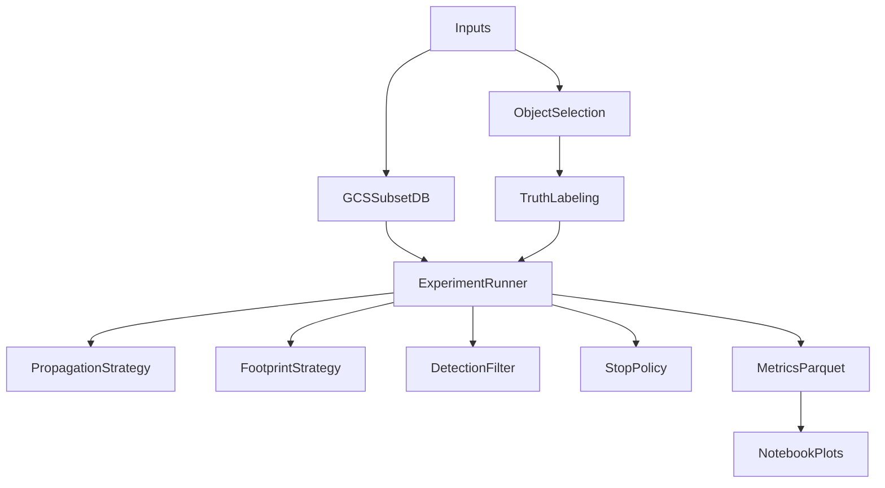

## Scope_and_success_criteria

- **Primary objective**: minimize compute cost (wall time + I/O) while meeting a target recovery recall over a curated, truth-labeled set of real objects and real detections.
- **Primary metric**: recall of truth detections (MPC-verified) recovered by precovery, reported overall and by regime (NEO close approach, long-Δt, TNO, short-arc, etc.).
- **Secondary metrics**: candidate count (precision proxy), frames scanned, observations loaded, healpix candidates, time breakdown per stage, and stability across obscodes/datasets.

## New_experiments_directory

Create a dedicated experiments package (kept out of `precovery/` runtime codepaths unless explicitly enabled):

- `experiments/covariance_precovery/`
  - `data/` (download + trimming)
  - `selection/` (object + time-window selection)
  - `truth/` (MPC/BigQuery-assisted truth labeling)
  - `methods/` (propagation strategies; footprint strategies; detection filters; stop policies)
  - `harness/` (runner + metrics aggregation)
  - `results/` (local output; ignored by git)

## Stage_1_Fetch_and_organize_inputs

### 1.1 Explore_and_subset_the_GCS_precovery_db

- Use GCS path: `gs://adam-dataset-dev/production/dagster/complete_precovery_db`.
- Determine the on-disk layout by listing (expected: `index.db` + `data/<dataset_id>/<YYYY-MM>/frames_*.data` matching `FrameDB`’s month partitioning in [`/Users/aleck/Code/precovery/precovery/frame_db.py`](/Users/aleck/Code/precovery/precovery/frame_db.py)()).
- Implement a **subset downloader** that can pull only selected dataset_ids + YYYY-MM partitions (3–6 months each) and write to a local working DB directory.
  - Prefer a Python implementation that shells out to `gcloud alpha storage cp` (mirroring [`/Users/aleck/Code/precovery/fetch_data.sh`](/Users/aleck/Code/precovery/fetch_data.sh)()) for consistency.
  - Include a manifest file (parquet/json) describing exactly which GCS objects were downloaded.

### 1.2 Build_a_trimmed_FrameIndex_(sqlite)_for_the_subset

- After downloading month partitions, build a trimmed `index.db` containing only rows for:
  - selected `dataset_id` values,
  - selected `obscode` values (T05, T08, I41, Q05, W84, …),
  - `exposure_mjd_mid` inside the chosen month range.
- Use `FrameIndex` schema from [`/Users/aleck/Code/precovery/precovery/frame_db.py`](/Users/aleck/Code/precovery/precovery/frame_db.py)().
- Validate `fast_query` index exists (the code warns if missing).

### 1.3 Choose_time_windows_to_cover_all_surveys

- Select 2–4 time blocks (each 3–6 months) that guarantee overlap across the desired obscodes:
  - include ≥2018 for SkyMapper overlap,
  - include ≥2019 for NSC overlap,
  - include a more recent block to capture “well-defined” modern arcs.
- Store the final chosen blocks in a versioned manifest.

### 1.4 Efficient_object_selection_(BigQuery+mpcq)_with_cost_controls

- Build a **two-stage candidate selection** to minimize BigQuery spend:
  - **Stage A (cheap BQ)**: find objects with observations in the selected time windows AND matching obscodes.
  - **Stage B (mpcq)**: fetch MPC observation histories for the shortlisted objects; compute arc length and proximity of last obs to the search window.
- Stratify selected objects by:
  - orbit class bins (NEO/APO/AMO/ATE, MCA, MBA, Trojan, Centaur, TNO),
  - short vs long arc,
  - “recently observed” vs “not recently observed”,
  - close approach inside window vs not.
- Persist:
  - selected object state vectors (with covariance) as a `quivr`/parquet table,
  - a compact per-object observation summary used for stratification.

## Stage_2_Propagation_strategy_benchmarks

Implement pluggable propagation strategies for generating per-frame/per-time ephemerides:

- **A_full_clone_MC_ASSIST**: draw orbit clones from 6D covariance; propagate all clones with ASSIST to each unique exposure time.
- **B_sigma_points_ASSIST**: unscented/cubature sigma points (13–25) with ASSIST.
- **C_hybrid_ASSIST_to_window_2body_to_frames**: ASSIST to window center (with covariance), then `propagate_2body` to per-frame times, matching what precovery already does in [`generate_ephem_for_per_obs_timestamps`](generate_ephem_for_per_obs_timestamps)(in `/Users/aleck/Code/precovery/precovery/precovery_db.py`).
- **D_2body_only_with_regime_trigger**: 2-body unless a trigger fires (e.g., close approach / inflated uncertainty), then upgrade to C or B.

Benchmark outputs per strategy:

- runtime vs #times,
- memory vs #clones,
- agreement/disagreement between strategies on predicted sky path across **both**:\n+  - **benign regimes** (where shortcuts should be safe), and\n+  - **perturbation-sensitive regimes** (where n-body physics matters).\n+\n+For perturbation stress testing, explicitly:\n+- identify object+window pairs likely to show divergence (e.g., close planetary encounters inside/near the search window, high-acceleration topocentric motion, long Δt propagation from last well-constrained arc),\n+- quantify divergence vs a chosen “reference” strategy (typically A or B), using sky-plane residual statistics over time (e.g., max/median great-circle separation and along/cross-track components),\n+- and correlate divergence with recall loss / footprint inflation in downstream stages (frame selection, detection filtering, stop policies).

## Stage_3_Healpixels_and_frame_intersections_(footprint_strategies)

Unify healpixel/frame selection behind a footprint interface, extending existing options in [`/Users/aleck/Code/precovery/precovery/precovery_db.py`](/Users/aleck/Code/precovery/precovery/precovery_db.py)():

- Existing (covariance-derived) footprint methods:
  - **disc** (`find_healpixel_matches_covariance`): major-axis bound + `query_disc`.
  - **ellipse_polygon** (`find_healpixel_matches_covariance_polygon`): N-σ ellipse boundary via `query_polygon`.
  - **covariance_mc_pixels** (`find_healpixel_matches_covariance_mc`): sample from 2×2 sky covariance.
- New (sample-derived) footprint methods (built from propagated sigma-points / clones on-sky):
  - **direct_sample_pixels**: map each sample RA/Dec to pixels + small neighbor/`max_pixrad` dilation.
  - **perimeter_polygon_samples** (naive polygon): build a perimeter polygon from sample cloud in tangent plane (angle-sort around centroid or monotone chain convex hull) and rasterize.
  - **corridor_tube**: order samples along principal direction; build a buffered polyline/tube; rasterize to pixels (via union of small discs along the polyline) and reuse for point tests.
  - **alpha_shape_concave_hull**: optional tight concave hull + buffer (add deps if needed, kept in experiments group).

Performance requirements:

- vectorize across unique times (avoid Python loops like the current per-row membership checks in `find_healpixel_matches_covariance_*`).
- cache per-time footprint pixels keyed by `(days,nanos)` (similar to current caching) but store arrays for fast `np.isin`/sorted membership.

## Stage_4_Detection_level_filtering_variants

Detection filtering happens after observations are loaded from frames.

- Baseline (already implemented): **χ²/Mahalanobis gate** using `Residuals.calculate` in `find_observation_matches_covariance` (in [`/Users/aleck/Code/precovery/precovery/precovery_db.py`](/Users/aleck/Code/precovery/precovery/precovery_db.py)()).
- Add fast prefilters (to reduce χ² calls and residual computations):
  - **point-in-footprint** using the same sample-derived footprint used for healpixel selection (corridor/polygon).
  - **ellipse prefilter** in tangent plane (cheap) before χ².
- Optional advanced scoring (experiments-only):
  - mixture-of-Gaussians from clone cloud in tangent plane (approx likelihood) to improve ranking.

## Stage_5_Stop_policies_(when_footprints_get_too_big)

Implement stop logic as a separate module so it can be tested independently:

- Inputs per time/batch: footprint area proxy, #candidate frames, #detections retrieved, #detections passing footprint, #detections passing χ².
- Policies:
  - **cost_guardrails**: hard caps on frames/pixels/detections fetched per batch.
  - **recall_preserving_adaptive**: tighten/loosen footprint credible mass (e.g., 3σ vs 2.5σ) subject to a recall floor.
  - **hysteresis_stop**: stop only after K consecutive batches exceed thresholds (to handle temporary close-approach inflation followed by shrinkage).
  - **efficiency_stop**: stop when accepted_truth / retrieved collapses below a floor for K batches.

## Test_and_benchmark_harness

### Experimental_runner

- Implement a runner that:
  - loads a local trimmed DB,
  - iterates selected objects,
  - runs a matrix of (propagation_strategy × footprint_strategy × detection_filter × stop_policy),
  - records metrics to parquet (quivr-friendly) per run.

### Pytest_integration

- Add experiment-marked tests alongside existing benchmarking patterns in [`/Users/aleck/Code/precovery/tests/test_benchmarks.py`](/Users/aleck/Code/precovery/tests/test_benchmarks.py)() and profiling in [`/Users/aleck/Code/precovery/tests/test_profile.py`](/Users/aleck/Code/precovery/tests/test_profile.py)().
- Use `pytest-benchmark` for microbenchmarks (footprint rasterization, membership filtering) and end-to-end benchmarks for representative objects.

### Notebook_alignment

- Reuse and extend the plotting/geometry helpers already present in [`/Users/aleck/Code/precovery/notebooks/visualize_covariance_skyplane.ipynb`](/Users/aleck/Code/precovery/notebooks/visualize_covariance_skyplane.ipynb)() for sanity visualizations and regression plots (area vs Δt, pixel counts vs methods, etc.).

## Architecture_diagram

